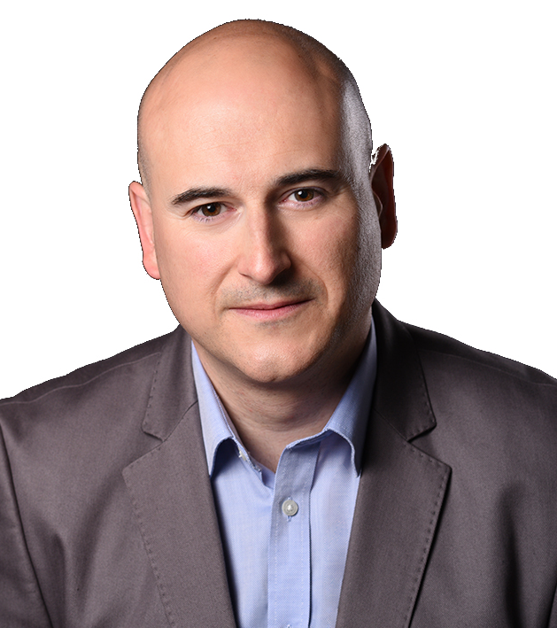

# Benedicto RODRIGUEZ CASTRO
<table>
  <tbody>
    <tr>
      <td></td>
      <td><pre style="font-family: 'Ubuntu Mono', 'Roboto Mono', 'Menlo', 'Monaco', 'Lucida Console', monospace;">
Address:      Munich, Germany
LinkedIn:     <a href="https://www.linkedin.com/in/beroca" target="_blank" rel="noopener noreferrer">www.linkedin.com/in/beroca</a>
Xing:         <a href="https://www.xing.com/profile/Benedicto_RodriguezCastro" target="_blank" rel="noopener noreferrer">www.xing.com/profile/Benedicto_RodriguezCastro</a>
Nationality:  Spain</pre>
      </td>
    </tr>
  </tbody>
</table>

**WORK EXPERIENCE**\
**Senior Software Engineer. SAP SE, Munich, Germany.** Mar 2023 – present
* Contributed to the full software development life cycle of multiple backend microservices (**Java, Spring Boot, [SAP Cloud Application Programming Model](https://help.sap.com/docs/SAP_CAP), SAP HANA, [SAP Business Technology Platform](https://help.sap.com/docs/btp?version=Cloud), Cloud Foundry**).
* Projects: [SAP Master Data Orchestration](https://help.sap.com/docs/SAP_MASTER_DATA_INTEGRATION/8ce78b673ef04cc1bcfeb01c93ef7885/0bed505b149b4ec6af24bf503a45708b.html?version=CLOUD)

**Senior Software Engineer. SAP Customer Experience, Munich, Germany.** May 2017 – Feb 2023
* Contributed to the full software development life cycle of multiple backend microservices (**Java, Spring Boot, SQL databases, Kafka, RESTful APIs, Flink, Druid**).
* Ensured compliance with the quality and security requirements of the organization across every microservice of the team (**WhiteSource/Mend, Fortify, SonarQube, CheckMarx**).
* Contributed to the Continuous Integration and Continuous Delivery (CI/CD) pipeline to build and release multiple microservices and applications (**Jenkins, Docker, Kubernetes, AWS**).
* Provided monitoring and on-call support of 10-15 microservices, following the approach *"you build it, you run it"* (**Kibana, Grafana, Splunk On-Call/VictorOps**).
* Acted as part-time Scrum Coach rotating the role periodically inside the development team.
* Obtained the certifications of **PSM-I (Professional Scrum Master)** and **ITIL4 Foundation** Certificate in IT Service Management (<a href="https://purl.org/beroca/certificates" target="_blank" rel="noopener noreferrer">https://purl.org/beroca/certificates</a>)
* Projects: [SAP Upscale Commerce](https://help.sap.com/docs/SAP_UPSCALE_COMMERCE) (retired), [Context-Driven Services](https://help.sap.com/docs/CONTEXT-DRIVEN_SERVICES) / [Intelligent Selling Services](https://help.sap.com/docs/INTELLIGENT_SELLING_SERVICES) for [SAP Commerce Cloud](https://help.sap.com/docs/COMMERCE?version=CLOUD)

**Information Technology Engineer. PAYBACK GmbH, Munich, Germany.** Feb 2015 – Dec 2016
* Deployed new software releases for 3 countries of the PAYBACK Global Platform.
* Managed country-specific business data configurations of PAYBACK partner companies.

**Research Associate. Technical University of Munich, Munich, Germany.** Jan 2014 – Jan 2015
* Contributed as software consultant to the technical reports of 2 European projects (BioMedBridges, BBMRI.eu) in the areas of medical data privacy and management of patients biosamples (**UML**).

**Research Associate. Bundeswehr University Munich, Munich, Germany.** Aug 2011 – Dec 2013
* Participated in the development of Web vocabularies (i.e. Web ontologies) of end-consumer commodity products (**W3C RDF, OWL, Protégé Ontology Editor**).
* Co-authored 4 research articles published in international conferences in the area of Semantic Web technologies (<a href="http://purl.org/beroca/publications" target="_blank" rel="noopener noreferrer">http://purl.org/beroca/publications</a>) and provided peer reviews of other 30+ articles (**LaTeX**).

**Senior Software Engineer. Motorola Solutions, Plantation, Florida, U.S.A.** Aug 1999 – Dec 2005
* Developed the low-level software testing API for the Motorola CN620 Windows CE mobile phone and supported API clients along the product development process (**C, Bash, C++**, Windows CE).
* Developed 2 low-level software drivers (UART RS-232, and watchdog) built into the Motorola radio products XTS2500, XTS5000, Astro Spectra Plus (**C, Bash**)
* Implemented a set of CLI tools to streamline the software snapshot builds of Motorola radio products consolidating code changes from 4 different teams (**C, Perl, Bash**, ClearCase version control).

**Internship. Hewlett-Packard (HP), Granada, Spain.** Aug 1994 – May 1996\
* Customized modules of HP's Hospital Information System (HP HIS) software for a local hospital (Transtools/Base100 **Multibase, SQL**).

**EDUCATION**  
**Ph.D. in Computer Science. University of Southampton.** Southampton, U.K. 2012.\
Thesis: Towards Ontology Design Patterns to Model Multiple Classification Criteria of Domain Concepts for the Semantic Web (<a href="https://purl.org/beroca/phd/thesis" target="_blank" rel="noopener noreferrer">https://purl.org/beroca/phd/thesis</a>). \
**M.Sc. in Computer Engineering. University of Miami.** Florida, U.S.A. 1999.\
**B.Sc. in Computer Science. University of Granada.** Granada, Spain. 1997.

**Languages:** Spanish (native speaker), English (proficient), German (intermediate).
